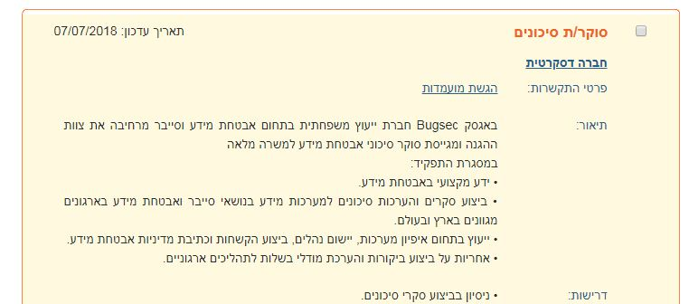
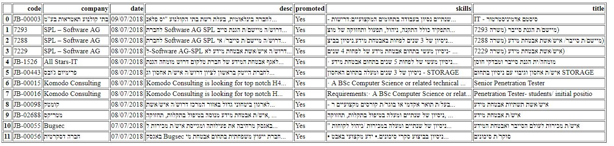
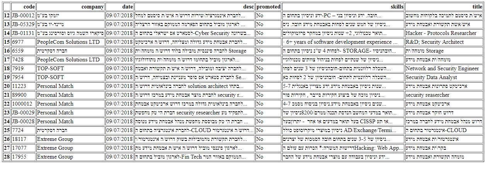

# jobscraper
get list of the promoted cyber jobs from job site and send attached to mail

source site : jobnet.co.il
## promoted job 

  

## regular job 

  

## output: html file with active promoted jobs 

  

##  html file with regular job details from current date 

  

